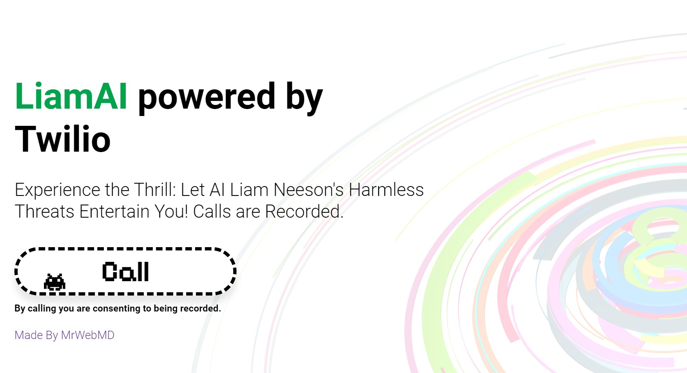
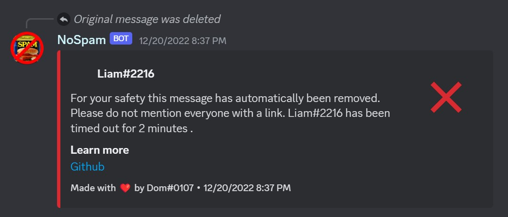
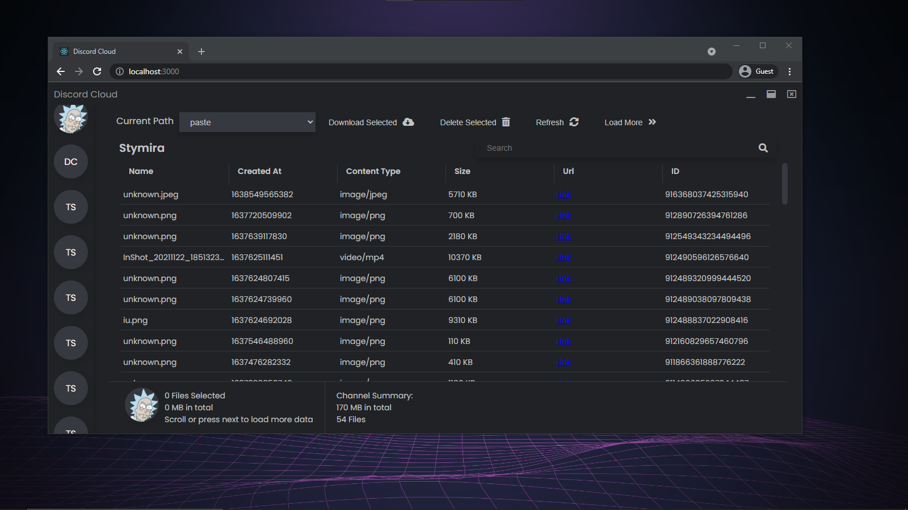
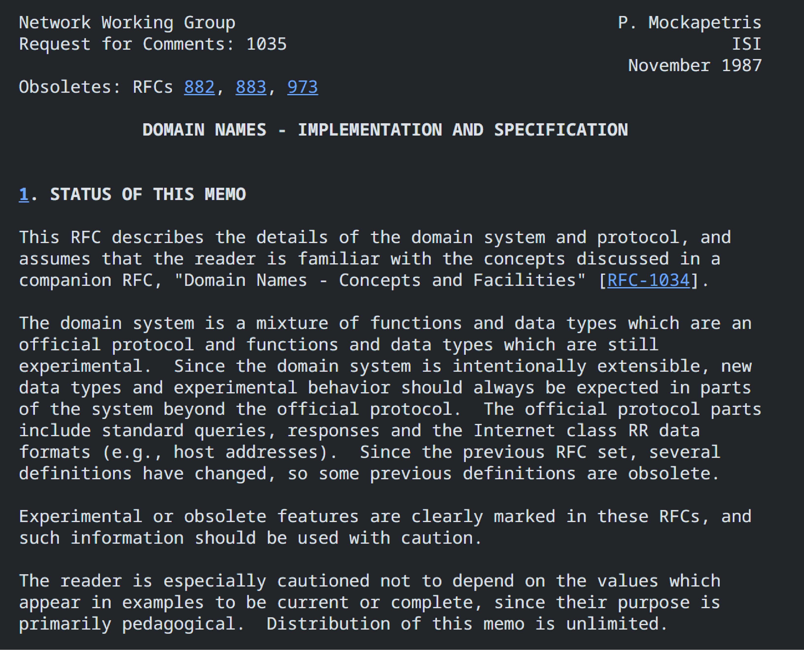
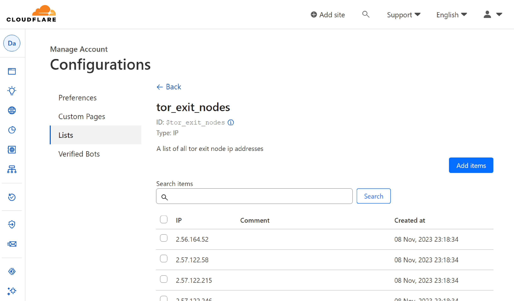

# Projects by MrWebMD

## Adobe Certified Professional In Web, Video, and Visual Design

## Liam AI

LiamAI is an AI with the ability to talk over the phone with one small twist, it has the ability to search public records on the fly for information related to the caller. This information is then used in a prompt sent to GPT-4 and can be presented in any way you like. By default, the AI is instructed to perform a threatening Liam Neeson impression from Taken.

**Technology:** GPT-4, Twilio, ElevenLabs, NodeJS, Typescript, Express, EJS  
**[Live Demo](https://liam-neeson.mrwebmd.com/)**  
**[Github](https://github.com/MrWebMD/liam-ai)**

## CloutCard.io

CloutCard offers creators a way to consolidate all of their social media links into a single, elegant page. Followers will easily be able to find all relevant social media accounts with one click.

**Technology:** Prisma, Postgres, React, NodeJS, NextJS, Typescript  
**[Live Demo](https://cloutcard.io/)**  
**[Github](https://github.com/MrWebMD/cloutcard)**

## SSHD Auth.log Visualizer

SSH is a service used on tens of millions of servers for remote maintenance, due to its nature it is often subject to attacks by the wider internet. This project geolocates unique IP addresses from the SSH service authentication logs on Linux systems and visualizes the origin of failed login attempts on a digital globe. Insights include total failed login attempts, unique login attempts, and attack count grouped by country of origin.

**Technology:** Three.js, TypeScript, NodeJS, Express, EJS  
**[Live Demo](https://sshd.mrwebmd.com/)**  
**[Github](https://github.com/MrWebMD/authlog-visualizer)**

## lilurl.co

lilurl.co is a URL shortener. You can give it any web URL and it will create a short, shareable one for you.

**Technology:** JavaScript, EJS, NodeJS, Express, SQLite  
**[Live Demo](https://lilurl.co/)**  
**[Github](https://github.com/MrWebMD/lilurl.co)**

## Phishing Training

Phishing is a kind of cyber attack that tricks individuals into offering sensitive information like passwords or installing malware. This website trains users to identify and protect themselves against phishing attacks including smishing (over text), and vishing (over the phone).

**Technology:** JavaScript, NodeJS, NextJS, React, SASS  
**[Live Demo](https://mrwebmd.com/)**  
**[Github](https://github.com/MrWebMD/PhishingTraining)**

## NoSpam

NoSpam is a Discord bot for taking action against spam on Discord community servers. It is capable of detecting duplicate messages and spam links. In addition, it can take action on offending messages by muting the author, deleting a message, or other actions. It is highly extensible and has been used to moderate a community of over 8000 individuals.

**Technology:** TypeScript, Node  
**[Github](https://github.com/MrWebMD/NoSpamBot)**

## Discord Cloud

Discord Cloud scans through text messages sent through Discord and creates an explorable file system out of it. Platforms like WhatsApp do this for you automatically, but Discord doesn't and there can be hundreds of thousands of messages sent in a community.

With ElectronJS and React, Discord Cloud is a file explorer that you can access as a desktop app and a website. Using Discord Cloud, moderators of large communities can easily review a large amount of media content sent by members.

**Technology:** ElectronJS, NodeJS, React  
**[Github](https://github.com/MrWebMD/discord-cloud-2)**

## PHP Shopping Basket

```mermaid
erDiagram
    USERS {
        bigint id PK "Unique identifier"
    }

    PRODUCTS {
        bigint id PK "Unique identifier"
        varchar sku "Stock Keeping Unit, Unique"
        varchar name "Product Name"
        decimal price "Product Price"
        datetime created_at "Creation Date"
        datetime updated_at "Last Update Date"
    }

    USER_PRODUCTS {
        bigint id PK "Unique identifier"
        bigint user_id FK "References USERS"
        int quantity "Product Quantity"
        bigint product_id FK "References PRODUCTS"
        datetime created_at "Creation Date"
        datetime updated_at "Last Update Date"
    }

    OFFER_TYPES {
        bigint id PK "Unique identifier"
        varchar value "Type Value"
        datetime created_at "Creation Date"
        datetime updated_at "Last Update Date"
    }

    OFFERS {
        bigint id PK "Unique identifier"
        varchar title "Offer Title"
        varchar description "Offer Description"
        bigint offer_type_id FK "References OFFER_TYPES"
        datetime created_at "Creation Date"
        datetime updated_at "Last Update Date"
    }

    QUANTITY_CONDITIONS {
        bigint id PK "Unique identifier"
        bigint offer_id FK "References OFFERS"
        int min_quantity "Minimum Quantity, Nullable"
        int max_quantity "Maximum Quantity, Nullable"
        datetime created_at "Creation Date"
        datetime updated_at "Last Update Date"
    }

    PRICE_ADJUSTMENT_TYPES {
        bigint id PK "Unique identifier"
        varchar value "Adjustment Type Value"
        datetime created_at "Creation Date"
        datetime updated_at "Last Update Date"
    }

    PRICE_ADJUSTMENTS {
        bigint id PK "Unique identifier"
        bigint offer_id FK "References OFFERS"
        bigint price_adjustment_types_id FK "References PRICE_ADJUSTMENT_TYPES"
        decimal value "Adjustment Value"
        datetime created_at "Creation Date"
        datetime updated_at "Last Update Date"
    }

    OFFER_PRODUCT {
        bigint id PK "Unique identifier"
        bigint offer_id FK "References OFFERS"
        bigint product_id FK "References PRODUCTS"
        datetime created_at "Creation Date"
        datetime updated_at "Last Update Date"
    }

    OFFER_PRICE_ADJUSTMENTS {
        bigint id PK "Unique identifier"
        bigint offer_id FK "References OFFERS"
        bigint price_adjustments_id FK "References PRICE_ADJUSTMENTS"
        datetime created_at "Creation Date"
        datetime updated_at "Last Update Date"
    }

    DELIVERY_CHARGE_RULES {
        bigint id PK "Unique identifier"
        decimal price "Delivery Price"
        decimal min_total "Minimum Total, Nullable"
        decimal max_total "Maximum Total, Nullable"
        datetime created_at "Creation Date"
        datetime updated_at "Last Update Date"
    }

    USERS ||--o{ USER_PRODUCTS : "purchases"
    PRODUCTS ||--o{ USER_PRODUCTS : "purchased"
    PRODUCTS ||--o{ OFFER_PRODUCT : "participates in"
    OFFERS ||--|| OFFER_TYPES : "categorized by"
    OFFERS ||--o{ QUANTITY_CONDITIONS : "restricts"
    OFFERS ||--o{ PRICE_ADJUSTMENTS : "modifies"
    OFFERS ||--o{ OFFER_PRODUCT : "includes"
    OFFERS ||--o{ OFFER_PRICE_ADJUSTMENTS : "adjusted by"
    PRICE_ADJUSTMENTS ||--|| PRICE_ADJUSTMENT_TYPES : "categorized by"
```

This project is an implementation of a basket system for Acme Widget Co Sales System, providing features for product catalogs, delivery charge rules, and special offers. The project's goal is to be easy, performant, extensible, and platform agnostic while meeting the criteria specified in the test. There is a large focus on code quality and readability. The code is heavily documented and contains examples that make it easier for new developers to understand and extend the codebase. Examples are included in the README and the tests which cover 100% of the codebase.

**Technology:** PHP  
**[Github](https://github.com/MrWebMD/AcmeBasket)**

## Nameserver

Using Python, I created a partial implementation of the RFC (request for comments) of the DNS (Domain Name System) protocol that is used for resolving domain names on the internet. [RFC 1035](https://datatracker.ietf.org/doc/html/rfc1035)

**Technology:** Python  
**[Github](https://github.com/MrWebMD/hamurai-name-server)**

## TOR Traffic Firewall

TOR (The Onion Router) is a privacy-focused browser and online network. At times, malicious traffic can originate from TOR. This project's goal is to help Cloudflare users block TOR nodes using the Cloudflare Web Application Firewall (WAF). It does this by fetching an updated list of TOR exit nodes from torproject.org and many other sources, then creating a Cloudflare list out of them. This new list can be used to create WAF rules which can block the exit nodes before they reach your website.

**Technology:** Typescript  
**[Github](https://github.com/MrWebMD/cloudflare-tor-firewall)**
